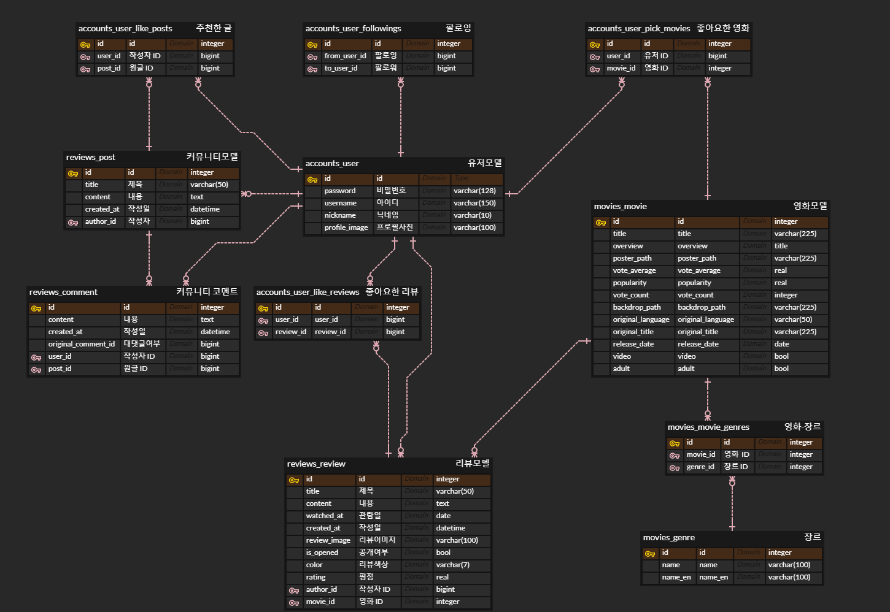
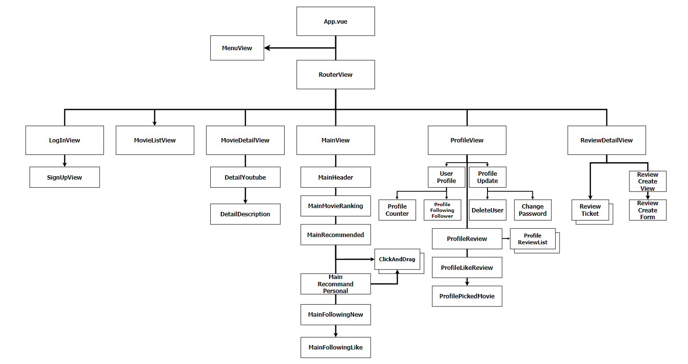
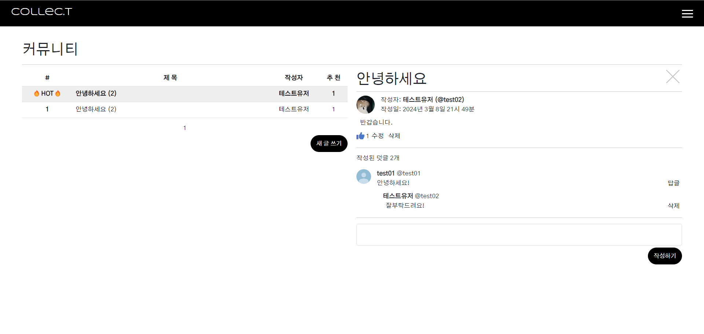

# SSAFY 10기 관통 프로젝트 :: 영화 추천 사이트

- SSAFY 1학기 관통 프로젝트 최우수상 수상
- 삼성 청년 SW 아카데미 (SSAFY) 교육 과정의 일환으로 진행된 프로젝트로, 내부 정책에 의거하여 소스코드는 미공개

### 1. 프로젝트 개요

---

- 프로젝트명: Collec.T (Collect + Ticket, 콜렉티)
- 프로젝트 개요: TMDB API를 활용하여 영화 추천 웹페이지 구현
- 진행 기간: 2023-11-16 ~ 2023-11-23
- 필수사항 
  ☑ 영화 데이터: 영화 데이터가 최소 50개 이상 존재할 것 
  ☑ 영화 추천 알고리즘 
  ☑ API: TMDB, YouTube API 사용 
  ☑ 커뮤니티기능 구현 

- 목표 
  ☑ 커뮤니티와 리뷰 기능 별도 구현  
  ☑ 팔로잉 및 리뷰에 기반한 추천 기능 구현  
  ☑ 동적인 페이지 디자인  

- ERD 및 컴포넌트 구조도

  #### ERD

  

  #### 컴포넌트 구조도

  

- 사용 프레임워크 및 라이브러리
   

  
  
  
  

  - Lodash
  - Dj-Rest-Auth
  - corsheaders

### 2. 팀원 정보 및 업무 분담 내역

---

| 이름   | 역할 | 업무분담                                                                                                                                           |
| ------ | ---- | -------------------------------------------------------------------------------------------------------------------------------------------------- |
| 백민정 | 팀장 | TMDB 데이터 크롤링 후 fixture 제작, ERD 설계, 컴포넌트 설계, 메인페이지/영화/리뷰티켓/커뮤니티/유저 프로필 관련 기능 BE&FE 구현, 전체 페이지 UI&UX |
| 서민주 | 팀원 | 로그인/회원가입/비밀번호 변경/회원 탈퇴 api 연동, 영화 좋아요 기능 제작, 영화 평점 별 표시, 발표 자료 제작                                         |

### 3. 서비스 설명 및 구현 화면

---

### 대표 기능

#### 1. 메인화면

- 영화 추천 기능

  - 미로그인시
    

    - 헤더에서 카테고리를 눌러 장르별 영화 목록으로 이동
    - TMDB 오늘의 영화 TOP 10 출력, 클릭 시 영화 상세 페이지로 이동
    - 해당 영화가 DB에 없을 경우 TMDB API를 이용하여 DB에 영화 정보 추가
    - 장르별/최초 개봉 년도별 랜덤 영화 10개 추천

  - 로그인시
    

    - 미로그인 기능 전체 지원
    - 가장 많은 리뷰를 작성한 장르의 영화를 추천
    - 팔로우 중인 유저가 최근 일주일간 작성한 리뷰 4개 조회
    - 팔로우 중인 유저가 최근 일주일간 리뷰를 작성한 영화 목록 출력

#### 2. 영화 상세 화면

- 영화 상세내용 조회

  - YouTube API를 활용하여 헤더 영역에서 예고편 영상 재생
  - 팔로잉중인 유저가 리뷰를 작성하였을 경우, 해당 리뷰 조회 가능

- 리뷰 작성/수정
  - 해당 영화의 리뷰 작성 가능 (입력 항목: 명대사, 감상, 관람일, 평점, 공개 여부, 프레임 색상, 배경 이미지)
  - 배경 이미지를 변경할 경우 티켓 이미지 해당 사진으로 변경
  - 프레임 색상이 밝을 경우 티켓 어두운 배경 + 어두운 글자로 처리, 어두울 경우 티켓 밝은 배경 + 밝은 글자로 처리하여 가독성을 높임

#### 3. 영화 목록

  

- 전체 영화 목록 조회
  - 인기순, 최신순, 평점순으로 정렬 가능
  - 장르별 필터링 및 제목으로 검색 가능
  - infinite scroll

#### 4. 커뮤니티

  

- 유저 커뮤니티 페이지
  - 댓글, 대댓글, 좋아요 기능
  - 게시글 및 댓글 유저 프로필을 클릭하여 프로필로 이동 가능
  - 최근 일주일간 작성된 게시글 중 추천수 상위 3개 상단 노출

#### 5. 프로필

 

- 유저 프로필 페이지
  - 팔로우, 언팔로우, 팔로잉/팔로워 목록 조회
  - 유저가 리뷰를 작성한 영화의 장르 통계하여 상위 5개 노출
  - 작성 리뷰 전체보기 및 검색 (클릭 시 팝업)
  - 좋아요(스크랩)한 리뷰 전체보기 (클릭 시 팝업)
  - 커뮤니티에 작성한 게시글 보기 (클릭 시 이동)
  - 좋아요(나중에 보기)한 영화 전체보기 및 검색 (클릭 시 영화 디테일 페이지로 이동)

#### 6. 로그인/회원가입 페이지

- 메뉴 및 로그인
  - 배경화면 랜덤 출력
  - 버튼 색상 랜덤 출력
  - 버튼 색상의 명도에 따른 폰트 색상 랜덤 출력
  - 예외처리 및 틀린 항목 반환

---

### 영화 추천 알고리즘

#### 1. 랜덤 영화 추천

- 비로그인 사용자의 경우, 메인 페이지에서 영화 제작 년도별/장르별 영화를 랜덤으로 추천받을 수 있습니다. (Lodash 이용)

#### 2. 팔로잉 기반 추천

- 로그인 후 타 유저를 팔로우한 사용자의 경우, 팔로잉 중인 유저가 일주일 이내에 리뷰를 작성한 영화를 '팔로잉 중인 유저가 최근 본 영화'로써 추천받을 수 있습니다.

#### 3. 리뷰 기반 추천

- 로그인 후 리뷰를 작성한 사용자의 경우, 작성한 리뷰의 장르를 바탕으로 가장 많이 본 장르의 영화 리스트를 랜덤으로 10개 추천받을 수 있습니다.

### 4. 느낀 점, 후기

---

#### 백민정

웹 만들기를 구상부터 구현까지 직접 경험해 볼 수 있어서 좋았습니다.  특히 시리얼라이저를 커스텀하여 원하는 정보를 FE로 보내고 그것을 웹에서 확인하거나, 수업에서는 배웠지만 실제로 사용할 일이 많지 않아 생소했던 prepatch_related, annotate 등을 사용하여 쿼리가 개선되는 것을 직접 확인하니 신기하고 재미있었던 것 같습니다. 또, 웹페이지를 구성할 때에도 평소 구현해보고 싶었던 디자인적인 기능들을 직접 구현할 수 있어 만족스러웠습니다.  막상 만들고 나니 추가하고 싶은 기능이나 아쉬운 부분도 많지만 목표했던 내용은 거의 달성할 수 있어서 보람찬 프로젝트였던 것 같습니다!  
마지막으로 팀원인 민주언니가 프로젝트의 주도권을 많이 양보해주셔서 기능을 추가하다보니 모델도 초안에 비해 많이 변경되었는데 유연하게 수용해주신 민주언니께 감사하다는 말씀 드리고 싶습니다~~! 언니 고생많았어^^!

#### 서민주

처음 프로젝트를 할 때, 어떤 방식으로 기능을 구현할지 감이 잡히지 않았는데, 제 파트너인 민정이 덕분에 제가 생각지 못한 기능들까지 구현할 수 있어서 좋았습니다. 또한 수업 시간에는 스켈레톤 코드가 있고 요구사항이 명확해서 딱 주어진 것만 하면 됐는데, 프로젝트는 스켈레톤 코드가 주어지지 않고 구현해야 하는 기능들을 제가 실제로 찾아야 했기 때문에 추후 현업에 나가서 개발을 할 때 스켈레톤 코드 없이 어떻게 개발을 해야 하는지 간접적으로 배울 수 있었습니다. 한편 아쉬운 점이 있다면 제 작업 속도가 제가 원하는 만큼 나오지 않아서 더 구현할 수 있는 기능을 다 구현하지 못한 것이 아쉬웠습니다. 이 부분은 추후 더 많은 공부를 통해 극복해야 하는 부분 같습니다.   마지막으로 팀장인 민정이가 제가 단번에 찾지 못했던 오류들을 많이 찾아주고, 작업 속도가 저보다 훨씬 빨라서 작업을 수월하게 할 수 있던 것 같습니다. 덕분에 프로젝트 잘 마무리하게 해줘서 고마워😊
